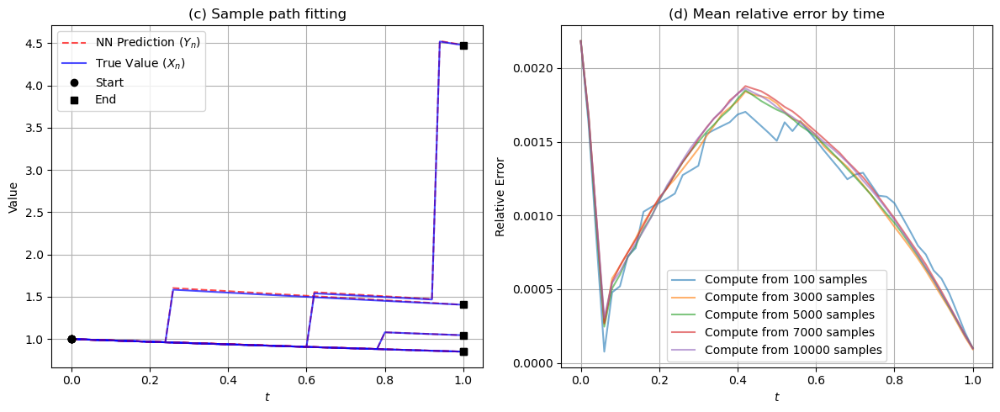

# FBSJNN: A Theoretically Interpretable and Efficiently Deep Learning method for Solving Partial Integro-Differential Equations

**arxiv**: [https://arxiv.org/abs/2412.11010](https://arxiv.org/abs/2412.11010)

**Authors** : Zaijun Ye, Wansheng Wang

## Paper Overview

- **Key idea:** FBSJNN is a deep learning framework designed to solve Partial Integro-Differential Equations (PIDEs) with jumps. It uses a single neural network to approximate both the PIDE solution and the nonlocal integral term by leveraging a Taylor expansion and automatic differentiation.
- 
- **Advantages:** Extends FBSDE-based methods to more general PDEs involving integral (nonlocal) terms.
- **Applications:**
    - Option pricing and financial modeling with jumps
    - Stochastic control in physics and engineering
    - Ecological and biological systems with discrete events
    - High-dimensional stochastic simulations

## Implemented Example

### 4.1: One-dimensional pure jump equation

**[expirement output]:**

  

### My Insight

interesting to see how a stochastic FBSDE framework can be systematically extended to cover deterministic PIDEs with integral terms.
While I believe equations with jumps can better capture real-world phenomena, I'm still unsure how best to apply them in practice.
