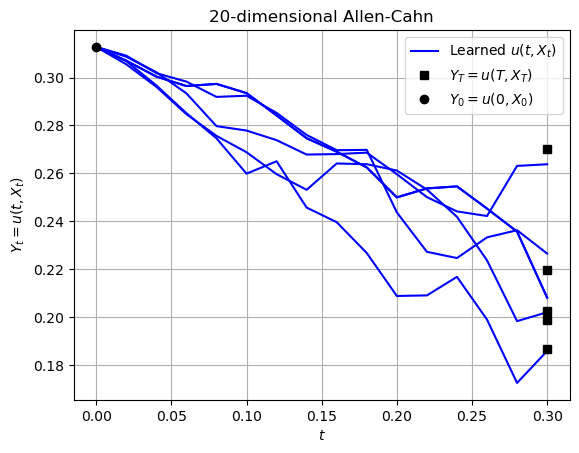

# Forward-Backward Stochastic Neural Networks: Deep Learning of High-dimensional Partial Differential Equations

**arxiv**: [https://arxiv.org/abs/1804.07010](https://arxiv.org/abs/1804.07010)

**Author:** Maziar Raissi 

## Paper Overview  
This paper proposes a novel deep learning framework that leverages *forward-backward stochastic differential equations* (FBSDEs) to solve high-dimensional partial differential equations (PDEs). By reformulating PDEs as systems of FBSDEs, the method bypasses the curse of dimensionality that traditional numerical solvers suffer from. The authors design a neural network to jointly learn the solution and its gradient through data-driven simulations of stochastic processes.

## Key Idea  
Reformulate deterministic high-dimensional PDEs as systems of forward-backward stochastic differential equations, then solve them using neural networks trained on simulated stochastic trajectories.

## Advantages  
- Scales well to **high-dimensional problems**
- Avoids the curse of dimensionality common in traditional PDE solvers
- Learns both solution and its gradient simultaneously
- No need for labeled training data from PDE solutions

## Applications 
- **High-dimensional control problems**
- Quantitative finance (e.g., pricing of derivatives)
- Physics-informed simulations
- Uncertainty quantification

## Implemented Example

### Section 4.3: Allen-Cahn Equation in 20D
I implemented **Section 4.3: Allen-Cahn Equation in 20D**, demonstrating the ability of this method to handle complex PDEs in high-dimensional spaces.

**[expirement output]**

  

My experimental result \( u(0, X_0) = 0.31278 \) closely approximates the reference value reported in the paper, \( 0.30879 \), demonstrating the effectiveness of the implementation.

