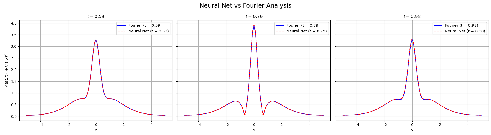

# Physics Informed Deep Learning (Part I): Data-driven Solutions of Nonlinear Partial Differential Equations

Maziar Raissi, Paris Perdikaris, George Em Karniadakis

## Paper Overview
The authers introduce Physics-Informed Neural Networks (PINNs), a framework that integrates physical laws, such as nonlinear partial differential equations (PDEs), directly into the training of neural networks. This allows for accurate solutions even with limited or noisy data.

- **Key idea:** Incorporate the PDE residual as a term in the loss function so the network learns to satisfy the underlying physical laws.  
- **Advantages:**  
  - High data efficiency  
  - Improved generalization compared to traditional numerical methods  
- **Applications:** Fluid dynamics, quantum mechanics, biomedical engineering, and more.

## Implemented Example

### Section 2.2: Schrödinger Equation
- Implemented the PINN approach to solve the Schrödinger equation as described in Section 2.2 of the paper.  
- The neural network is trained to satisfy both the PDE and boundary/initial conditions.  
- This notebook reproduces the example presented in the paper.
- 
**[expirement output]**

  

### My Insight

There is a singularity (or a challenging region) concentrated around the interval  [−1,1], so sampling more points in the x-grid within this area could improve the results. Also, my current code does not use a scheduler; I believe increasing the number of epochs and incorporating a scheduler would help further reduce the error.

---

## File Contents

- `shrodinger3.ipynb`: Jupyter notebook implementing the Schrödinger equation example using PINNs  
- `README.md`: This overview file
